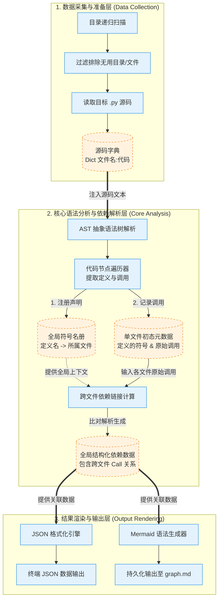

# Prototype 业务架构与逻辑拆分

基于对 `prototype_script.py` 的分析，整个脚本的业务逻辑可以高度抽象并拆分为三个核心的模块层级：**数据采集与准备层**、**核心语法分析与依赖解析层**、**结果渲染与输出层**。

以下是描述该脚本整体业务逻辑流转与系统架构的 Mermaid 流程图：

## 业务模块高层拆分说明

### 1. 数据采集与准备层 (Data Collection)
此层作为数据输入口，对应脚本中的 `getAllSrcData` 方法。
- **业务职责**：在指定路径下进行文件系统的遍历，应用忽略规则（如跳过 `__pycache__`、`.venv`、`.git` 等），安全地将有效 Python 文件的文本内容读入内存。
- **业务输出**：一个结构化的文件代码映射字典，为下一步提供纯净无干扰的分析输入源。

### 2. 核心语法分析与依赖解析层 (Core Analysis)
这是整个架构的中枢系统，对应脚本中的 `CodeAnalyzer` 类和 `analyze_project` 方法，其内部进一步划分为两个核心子阶段：
- **节点解析阶段（单体提取）**：利用原生的 AST（抽象语法树）将文本结构化，通过自定义的 Visitor 模式，遍历提取出每个文件内部“**定义了什么**”（类、函数等）和“**调用了什么**”（执行的函数名或属性）。此阶段将产生全局符号词典。
- **依赖关联阶段（网状链接）**：利用上一步聚合的全局符号名册，将单个文件内部发出的“未确定指向的调用”进行全局比对。一旦命中，则在两者之间建立跨文件调用的图依赖关联，消除冗余信息并生成最终的图结构拓扑数据。

### 3. 结果渲染与输出层 (Output Rendering)
此层负责将抽象的图状数据转换回用户或外部系统所需的直观表现形式。对应 `generate_mermaid` 方法及 `main` 函数中的输出逻辑。
- **业务职责**：支持多种异构格式输出。不仅能输出标准 JSON 提供给机器级接口作下游二次开发使用，还可以组装为 Mermaid（基于 Markdown）的图形化声明代码 `classDiagram`。
- **业务输出**：控制台文本打印以及落地到本地的 `graph.md` 文件。

---

## 重新设计：系统目标与 MVP 量化

### 1. 系统的最终目标是什么样的？
最终目标是构建一个**非侵入式的 Python 项目静态分析工具**，它能够自动提取代码库中的结构和依赖关系，并将其可视化或结构化输出。核心价值在于帮助开发者（或 AI 辅助编程工具）快速理解一个陌生或复杂 Python 项目的高层架构和模块间交互。

### 2. 这个目标该如何量化描述？
- **准确率**：对于标准 Python 语法（如简单的类定义、函数调用、跨文件 Import 和直接调用），依赖分析的准确率和召回率。
- **处理性能**：能够在一个合理的时间内（例如 10 秒内）分析中小型规模（例如几万行代码，数百个文件）的 Python 项目。
- **输出格式**：至少支持输出结构化的 JSON（供二次处理）和 Mermaid 格式图表（供人类直观理解）。
- **健壮性**：能平稳处理有语法错误的文件（记录警告并跳过）或极端复杂的单文件，不至于导致整个程序崩溃。

### 3. 端到端测试 (MVP 验收标准)
> *注：端到端测试材料采用现有真实工程，MVP 实现后人工运行、校验并固化为通过标准。*
- **输入**：指定一个典型的真实开源/业务 Python 工程目录作为根路径。
- **过程**：使用该工具对该目录执行分析，不报错，不崩溃，正常输出结果。
- **输出**：
    1. 生成一份包含该项目中主要模块间调用关系的 JSON 文件。
    2. 生成一份对应的 Mermaid 架构图（或类图）的 Markdown 文件。
- **MVP 判定**：人工核对这两种输出结果，若能真实、准确地反映该目标项目内*高频/核心*的跨文件/跨类的方法级调用关系，且无明显的常识性逻辑错误（如把系统库当成内部定义，或把不相干的文件错连），则认为 MVP 完成，并以此为基准固化测试用例。

## 架构重构：程序的驱动机制

针对这是一个基于 Python 构建的静态代码分析命令行工具（CLI），驱动机制的一句话总结如下：

**语言是 Python，入口是基于 `argparse` 或 `Click` 构建的命令行 CLI（根据参数编排输入、分析、输出流程），核心分析利用 Python 内置的 `ast` 模块结合 `Visitor` 模式驱动遍历，异常处理方式是基于 `try...except` 捕获特定阶段（如文件 I/O、单文件语法解析失败）的异常并利用 `logging` 模块记录警告，保证主流程不中断。**