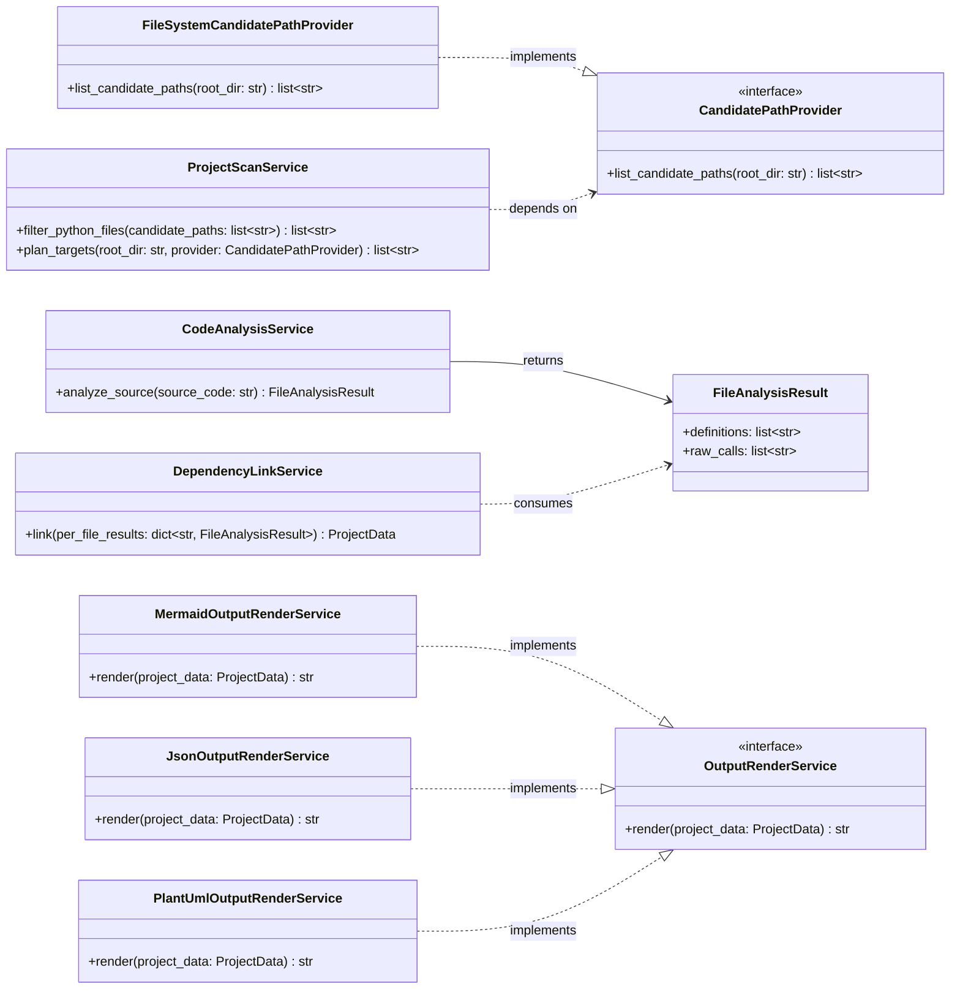

```mermaid
classDiagram
    direction LR

    class CandidatePathProvider {
        <<interface>>
        +list_candidate_paths(root_dir: str) list~str~
    }

    class FileSystemCandidatePathProvider {
        +list_candidate_paths(root_dir: str) list~str~
    }

    class ProjectScanService {
        +filter_python_files(candidate_paths: list~str~) list~str~
        +plan_targets(root_dir: str, provider: CandidatePathProvider) list~str~
    }

    class CodeAnalysisService {
        +analyze_source(source_code: str) FileAnalysisResult
    }

    class FileAnalysisResult {
        +definitions: list~str~
        +raw_calls: list~str~
    }

    class DependencyLinkService {
        +link(per_file_results: dict~str, FileAnalysisResult~) ProjectData
    }

    class OutputRenderService {
        <<interface>>
        +render(project_data: ProjectData) str
    }

    class MermaidOutputRenderService {
        +render(project_data: ProjectData) str
    }

    class JsonOutputRenderService {
        +render(project_data: ProjectData) str
    }

    class PlantUmlOutputRenderService {
        +render(project_data: ProjectData) str
    }

    MermaidOutputRenderService ..|> OutputRenderService : implements
    JsonOutputRenderService ..|> OutputRenderService : implements
    PlantUmlOutputRenderService ..|> OutputRenderService : implements

    FileSystemCandidatePathProvider ..|> CandidatePathProvider : implements
    ProjectScanService ..> CandidatePathProvider : depends on
    CodeAnalysisService --> FileAnalysisResult : returns
    DependencyLinkService ..> FileAnalysisResult : consumes
```
