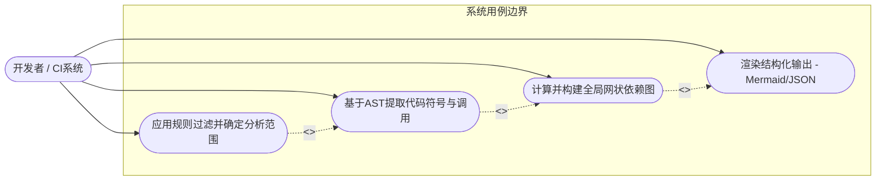
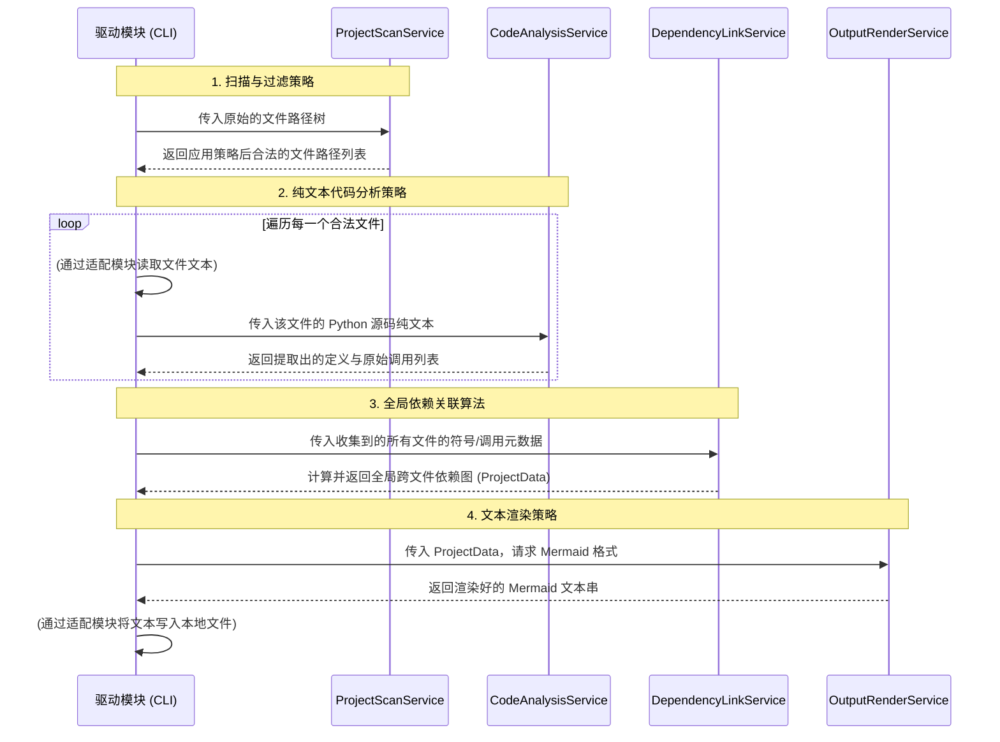
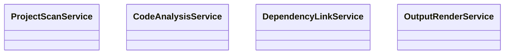

# 服务模块设计与初始全局类图

根据《六君子架构理论》，**服务模块（Service Module）**是算法、策略、逻辑的载体，是纯粹计算和业务意图的体现，必须能够通过纯内存操作完成测试。基于我们先前确定的业务架构（扫描、分析、连线、渲染），我们将系统的核心业务划分为以下四个主要的服务模块。

本文档综合运用了用户故事、用例图、时序图等工具对服务模块进行初步设计，并给出了初始版本的全局类图。

---

## 1. 需求分析与用例设计

### 1.1 用户故事 (User Stories)
为了明确各个服务模块的职责边界，我们首先以敏捷开发中的用户故事来描述需求：

- **作为一名 Python 开发者**，我希望给定一个项目路径，工具能按规则筛选出有效的 `.py` 文件（排除 `.venv`, `__pycache__` 等），以便分析范围精准。*(对应：扫描策略)*
- **作为一名软件架构师**，我希望工具能深入到每一个 Python 代码文件中，提取出所有的类、函数的定义，以及代码中发出的函数调用，以便我能快速理解项目细节。*(对应：语法解析策略)*
- **作为一名软件架构师**，我希望工具能将各个文件里的散落调用，与全局的定义进行匹配连线，从而构建出一张完整的跨文件依赖网络。*(对应：依赖关联计算)*
- **作为一名文档编写者**，我希望工具能直接将依赖网络输出为 Mermaid 格式的文本，以便我能无缝将其嵌入到 Markdown 文档中。*(对应：文本渲染策略)*

### 1.2 系统用例图 (Use Case)

*注：采用 Mermaid 流程图模拟标准用例图*

---

## 2. 服务模块划分与交互时序 (Sequence Diagram)

在这个阶段，我们将核心业务逻辑抽离为具体的**服务模块**。注意，服务模块不直接接触外部环境（如不直接读写硬盘文件），文件 I/O 等操作后续将由**适配模块**实现。服务模块仅负责“策略”与“计算”。

1. **ProjectScanService (项目扫描策略服务)**: 维护过滤规则（黑白名单），接收目录树结构信息，返回应该被处理的目标文件列表。
2. **CodeAnalysisService (代码分析服务)**: 接收纯文本的 Python 代码字符串，执行 AST 遍历，提取出当前文件的定义（Definitions）与调用（Calls）。
3. **DependencyLinkService (依赖关联服务)**: 接收所有文件提取出的初态元数据，执行全局符号匹配算法，输出一张跨模块的图状依赖数据结构。
4. **OutputRenderService (输出渲染服务)**: 接收图状依赖数据结构，执行字符串模板渲染策略，生成 Mermaid 或 JSON 文本。

### 核心服务交互时序图

以下时序图展示了在“驱动模块”（如 CLI Main 函数）的调度下，这四个服务模块是如何在不直接进行 I/O 的前提下完成业务闭环的：

---

## 3. 初始全局类图 (Global Class Diagram)

根据您的要求，目前的全局类图中**只存在几个基本的服务模块**。它们纯粹作为业务领域的占位符，暂时没有任何访问接口（Access Interface）、依赖接口（Dependency Interface）或具体的服务策略函数，仅代表了系统高层业务逻辑的物理切分。

